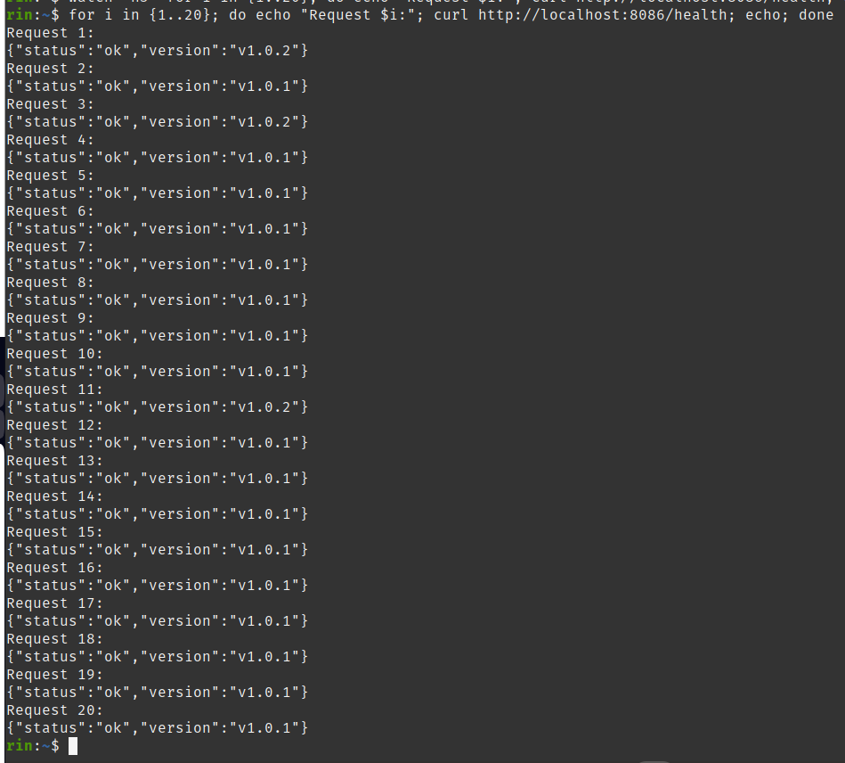
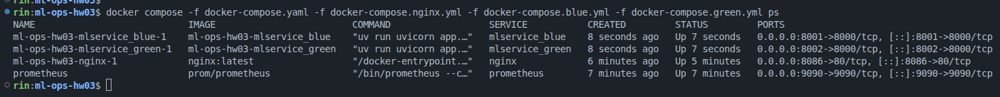
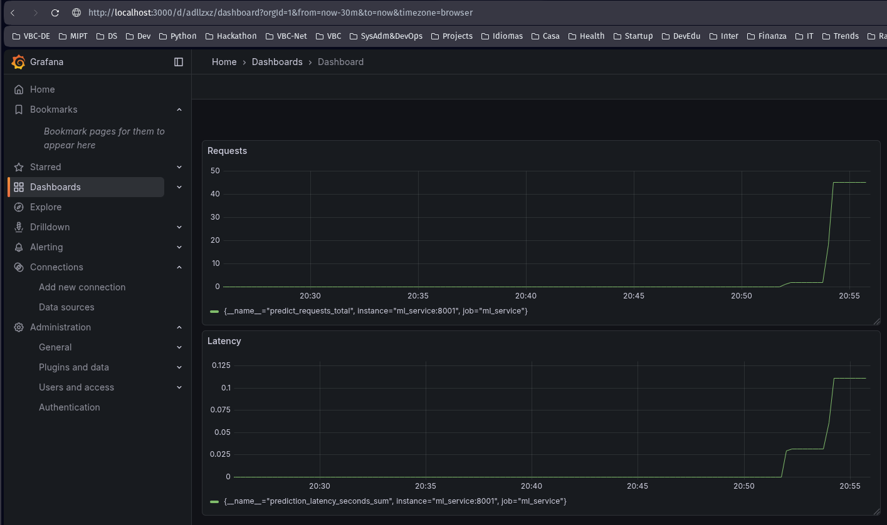
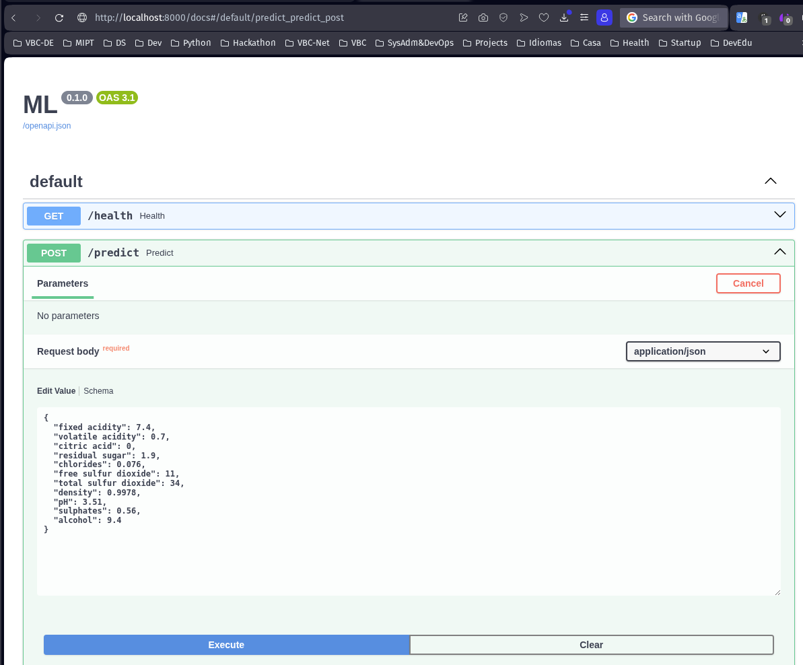
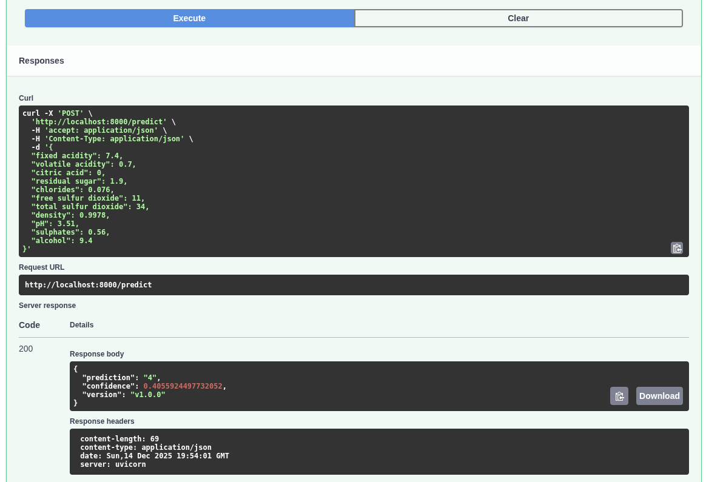

# README

ДЗ-3. Blue-Green деплой и мониторинг.
Модель из ДЗ-1.

## Архитектура

```
┌─────────┐      ┌───────────────┐      ┌──────────────────┐
│ Client  │─────▶│  Nginx (LB)   │─────▶│  mlservice_blue  │ (weight)
└─────────┘      │  :80          │      │  :8000           │
                 └───────────────┘      └──────────────────┘
                        │               ┌──────────────────┐
                        └──────────────▶│  mlservice_green │ (weight)
                                        │  :8000           │
                                        └──────────────────┘
```

## Структура проекта

```
ml-ops-hw03/
├── .github/
│   └── workflows/
│       └── deploy.yml          # Деплой не доделан
├── app/
│   ├── main.py                 # FastAPI приложение, эндпоинты
│   ├── models/                 # ML модель и скейлер 
│   │   ├── wine_quality_model.pkl
│   │   └── wine_scaler.pkl
│   └── server/
│       └── inference.py        # ModelRunner: загрузка модели, предсказания
├── docker-compose.yaml         # Prometheus + Grafana
├── docker-compose.nginx.yml    # Nginx
├── docker-compose.blue.yml     # Blue инстанс сервиса
├── docker-compose.green.yml    # Green инстанс сервиса
├── Dockerfile                  #
├── nginx.conf                  # Конфиг Nginx 
├── prometheus.yml              # Конфиг Prometheus 
├── pyproject.toml              # Я использовал uv для управления зависимостями
└── uv.lock
```

## API Endpoints

| Метод | Endpoint   | Описание                           |
|-------|------------|------------------------------------|
| GET   | `/health`  | Health check, возвращает версию    |
| POST  | `/predict` | Предсказание качества вина         |

### Пример запроса `/predict`

```json
{
  "fixed acidity": 7.4,
  "volatile acidity": 0.70,
  "citric acid": 0.00,
  "residual sugar": 1.9,
  "chlorides": 0.076,
  "free sulfur dioxide": 11.0,
  "total sulfur dioxide": 34.0,
  "density": 0.9978,
  "pH": 3.51,
  "sulphates": 0.56,
  "alcohol": 9.4
}
```

## Метрики Prometheus

- `predict_requests_total` — счётчик запросов к `/predict`
- `prediction_latency_seconds` — гистограмма времени предсказания
- `predict_errors_total` — счётчик ошибок

## Локальный запуск

```bash
# Запуск всех сервисов (nginx + blue + green + prometheus + grafana)
docker compose -f docker-compose.yaml -f docker-compose.nginx.yml \
  -f docker-compose.blue.yml -f docker-compose.green.yml up -d

# Проверка статуса
docker compose -f docker-compose.yaml -f docker-compose.nginx.yml \
  -f docker-compose.blue.yml -f docker-compose.green.yml ps
```

**Порты:**
- `80` — Nginx (API через балансировщик)
- `8001` — Blue сервис напрямую
- `8002` — Green сервис напрямую  
- `9090` — Prometheus
- `3000` — Grafana

## Screenshots











